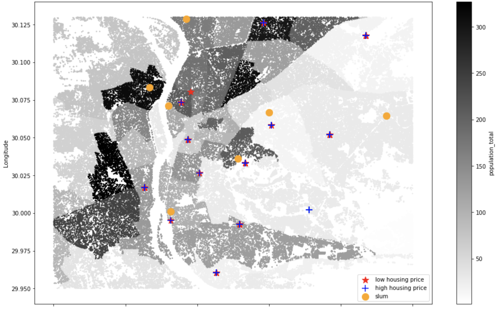

# Informal Settlements

Problem Statement: Mapping of informal settlements with satellite imagery is a long-standing practice, but such methods could be enhanced through web-scraped real-estate data. This project would build a web scraper to house and apartment adverts for a selected city in Africa/Latin America/Middle East. The scraper should download all adverts in the city during a recent period (ideally 3 years or more); and map all the adverts. The project should test the feasibility of estimating informal tenure from this information. Using gridded population estimates (e.g. from Facebook), the team would calculate the ratio of real estate adverts with population density. This ratio could serve as an input to machine learning models aimed at mapping informal settlements.

## Description of an Informal Settlement

Per the OECD (https://stats.oecd.org/glossary/detail.asp?ID=1351)

Informal settlements are:

1. areas where groups of housing units have been constructed on land that the occupants have no legal claim to, or occupy illegally;

2. unplanned settlements and areas where housing is not in compliance with current planning and building regulations (unauthorized housing).

The official definition of informal settlements given by the Egyptian government: "Slums are neighborhoods that have been constructed in absence of planning and beyond the supervision of formal governmental administrative and planning bodies. They are in violation of building and urban planning codes and represent an intrusion on agriculture land and/or state property. In most cases, they are deprived from the minimum standards of services and infrastructure” (1)

3. "Using GIS in constructing area-based physical deprivation index in Cairo Governorate, Egypt"Habitat Habitat International, April 2010.

## Introduction
### Client Needs

1. A short write up describing the project, results, and next steps or proposal to scale

2. Open source code for full process from gathering data to calculating and mapping the real estate to population density ratio

3. Proof of concept or pilot from a city or collection of cities.

### Cairo
Of the 17 million inhabitants in Greater Cairo (as of 2009), 11 million - or 63 percent, inhabit areas that have been developed informally or extra-legally since 1960. The  Central Agency for Public Mobilisation and Statistics (CAPMAS) estimates the number of slums in Egypt is over 1,000, with more than 300 of them in the Greater Cairo area.

‘Informal settlements’, or ‘Ashwa’iyyat’ in Egypt are now called ‘unplanned areas’ and ‘unsafe areas’ and are under the jurisdiction of the 2009-created government agency: Informal Settlement Development Facility (ISDF). Within these informal settlements, areas which are considered unsafe are estimated to have 1.1 million residents.

Geographically, Cairo extends over the east bank of the Nile from Shubra in the north and Heliopolis and Nasr City in the northeast to Helwan in the south. Administratively, Cairo is divided into 292 'shiakhas'. The shiakha is the minimum administrative unit for which the Central Agency for Public Mobilization and Statistics (CAPMAS) publishes census and other data. These shiakha vary in size ranging from 0.02 km2 (Safi el Dein) to 19.765 km2 (El Mokatom). Each of these shiakha has a separate administration through which they are managed under the authority of the governor.

2. https://www.middleeasteye.net/features/life-slums-cairo, 3. https://www.ucl.ac.uk/dpu-projects/Global_Report/pdfs/Cairo.pdf, 
4.  https://thearabweekly.com/egyptian-project-seeks-revolutionise-urban-slums, 5. https://www.researchgate.net/figure/Comparison-between-the-official-list-of-slum-areas-in-the-governorate-of-Cairo-and-the_fig2_248524259

### Other Cities
At the time we selelcted Cairo as our city to apply our case study, we also spent time looking at other places such as Nairobi, Kenya. The issue we had with Nairobi was with the lack of location data for the real estate ads. In general, the othe information provided was a few photos of the home, type of housing, beds & baths, and the price. The location was marked as Nairobi or at best a section within Nairobi, Kenya. Never an actual, exact streeet address was provided. Additionally, we reached out to HassConsult on obtaining more information on real estate ads, specifically Nairobi. Their response gave some insight on the real estate advertisments, which are often listed on newspapers and social media feeds. They also mentioned that real estate data on Informal Settlements is rarely collect or listed, where we would need to specifically request a bespoke data collection. 

## Team Tasks

Christopher Bump
- Scrape https://www.propertyfinder.eg/en/ for property information and store into database/csv file
- Populate property database with lattitude and longitude for each row of data

Sean Frey
- Lead the project, deliberating tasks, and ensure the repo is managed
- Collect libraries for mapping such as GeoPy and GeoPandas
- Map out the population denisty and realestate data against eachother
- Devise a model to train and run on the city of Cairo

Kevin Lu
-  Use [Facebook Data For Good](https://data.humdata.org/dataset/highresolutionpopulationdensitymaps-egy) to visualize population density and demographic in Cairo, Egypt and study the correlation between population density with location of slum areas

Matthew McDermott
- Online Research to gather contact information for organizations in Egypt and the U.S. Contacted organizations in search of GIS data on informal settlements and advice on finding real estate, utitilties, and other location-based information. Result: most organizations did not respond. Those that did declined to help and cited only working with large multinationals. 
- Online Research to gather information on informal settlements from websites, new articles, and academic articles. The most useful sources were academic articles. Also, gathered names of informal settlements and latitude/longitude data, which was very scarce.

Rytas Vitkus
- Scrape population density / population / area on a more targetted district map (https://www.citypopulation.de/en/egypt/greatercairo/)
- Clean and compare harvested density data against all the housing advertisments available in Cairo
- Determine if the ratio hypothesis (lower ratio = more likely to be a slum area / informal settlement) holds true

### Outcome
#### Population studies
The dataset only includes population and demographics of facebook users in Cairo, Egypt. Many elder population who don't use facebook are not included. The initial hypothesis is that there is a positive correlation between population density and slum areas, which means that the higher the population density, the higher chance the region is identified as an informal settlement. However, from our visualization study, there doesn't seem to have an obvious correlation between population density and slum areas, as some slum areas are identified at regions with low population density.

#### Web and location scraper
Four functions were created in order to automate the webscraping and pulling lattitude/location from a geocoder. 

- `def first_scrape(soup_obj,type_col, country):` 
>Scrapes the first page from one type of the propertyfinder site to produce a pandas database that will be appended later 

- `def append_first_scrape (target_url, target_slug, end_page, dataframe, type_col, country):` 
>Iterates through a single section(buy,rent,commericial,new projects) of the website "end_pages" number of times, skipping the first page and add that information to the database created by the first function. 

- `def egypt_property_web_scraper(url, slug_list, soups_list, order_list,num_iter):` 
>This function combines first_scrape and append_first_scrape to be used in one function that will gather multisections of the website and return everything as one final database. 

- `def Lat_Long_Finder(dataframe, start_num, locator):`
>This function will attempt to add and populate a lattitude and longitude column for each row of data.

#### Mapping and Modeling
With the latitude and longitdue for both the population and real estate data, we were able to map out the two against each other to observe their relationship. Coupled with these two features, we were able to apply seven known informal settlement locations to further our observations. Unfortunately, similar to the population denity there is no discernible relationships between the informal settlements and the real estate advertisements; partly due to the limited number of ads and the GeoPy providing the same latitude and longitude for multiple real estate listing. Property finder's site provides the location for each listing, not with a street address, but with the subdivision and city. This caused the distribution of real estate listings to be centralized to only several subdivisions, not enough distribution to determine how it is correlated to the informal settlements. 

If we were to have more population density information and a better distribution of real estate locations, I would create a model based on gridding over the two features and train and their relationships with known informal settlement locations. Each grid size would be arbitrary and depend on the resolution desired, and the ratio of advertisments to population make give a probability of an infromal settlement residing inside that square.

#### Conclusion 
Looking back at the outcome of this project, the biggest hurdle to climb was ensuring the locations were correct. It is an issue for Cario and, as mentioned before, other cities in developing countries. If the fidelity of real estate latitude and longitude was icnreased, there could be something to be said about this approach; otherwise, the outcome will largly remain undefined.

#### Next Steps
Moving forward with this project, our recommendations would be refining the housing data Longitude and Latitude as well as pulling from other sources such as social media posts. Couple that with other cities, a well working model can be developed to assit with Informal Settlement indentification.

### Obstacles & Ideas That Did `NOT` Work
- Limited amounts of housing data available on public property websites
- Realtors that responded to us either told us we weren't big names like Facebook / Google / Amazon, or wanted to charge for data.
- Wanted to acquire data on utilities, access to public schools, sewage, neighborhood affluence, median income
- Matching names across various websites for the same neighborhood was time consuming to build a composite database of 'common names'
